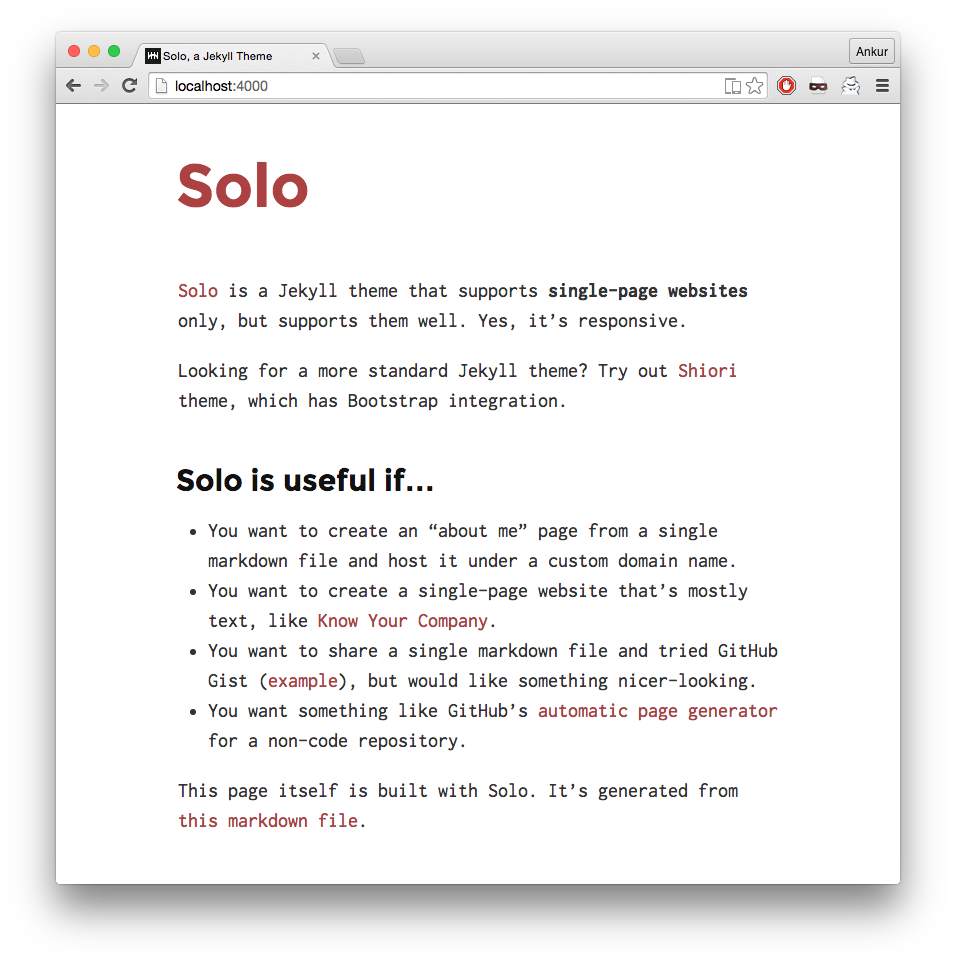

# Solo 

Solo is forked from [Solo](http://chibicode.github.io/solo), which is a Jekyll theme that supports **single-page websites** only, but supports them well. Yes, it's responsive.

### Color Themes

Solo ships with eight optional based on [Lanyon Color Themes](https://github.com/poole/lanyon). You can apply a theme that changes the color of the title and links (more elements to be added later). By default, no theme is used and the titles are colored black and links are colored blue. 

These are the eight themes available:


To use a theme, simply add a theme class to the `<body>` element in the `_layouts/default.html` as follows:

```html
<body class="theme-base-08">
  ...
</body>
```

This is an example of using the red (`theme-base-08`) color theme.



Thanks to [Poole](https://github.com/poole) for creating these themes for Jekyll.


